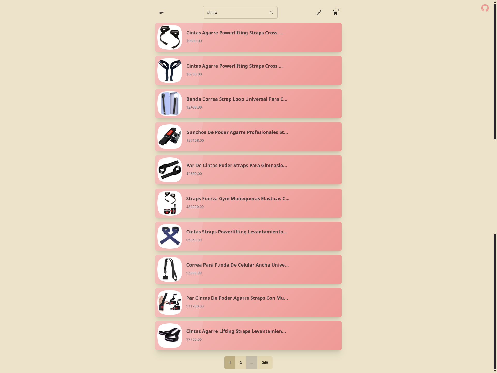
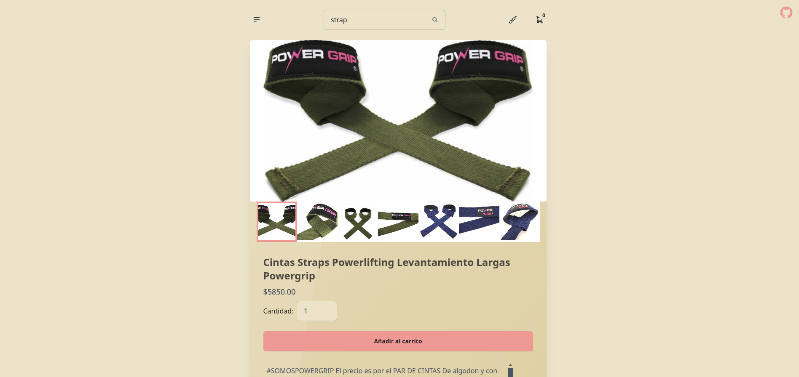
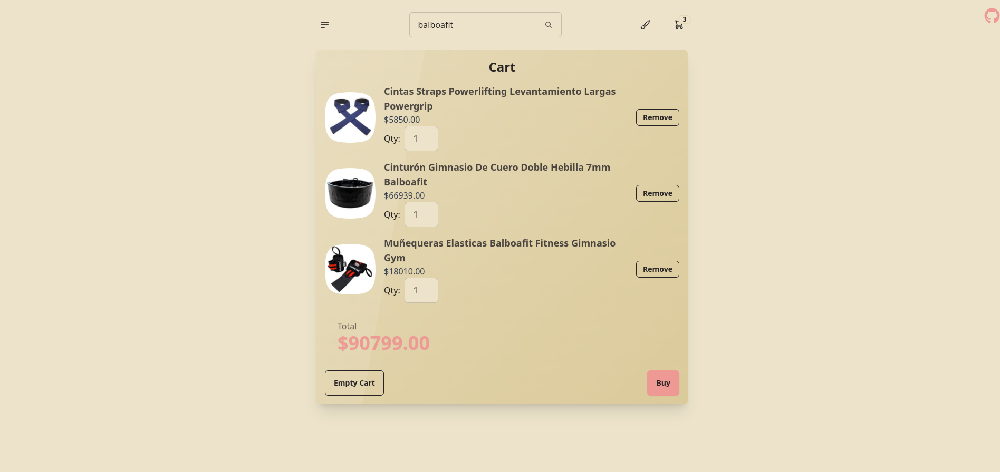

# Proyecto: Página de Compras con API de Mercado Libre  

## Descripción  
Este proyecto es una aplicación web desarrollada con JavaScript que consume la API de Mercado Libre para crear una página de compras. La aplicación permite buscar productos, ver detalles, añadir productos al carrito, gestionar el carrito y finalizar la compra.

### Funcionalidades  
#### Home Page:  
- Buscador con un botón para realizar la búsqueda.  
- Lista de resultados de búsqueda con imagen del producto, título y precio.

#### Detalles del Producto:  
- Página de detalles del producto con información adicional como descripción, precio e imágenes adicionales.

#### Carrito de Compras:  
- Añadir productos al carrito utilizando localStorage.  
- Visualización del carrito con productos añadidos, cantidad de cada producto y precio total.  
- Funcionalidades para aumentar/disminuir la cantidad de productos y eliminar productos del carrito.

#### Finalizar Compra:  
- Botón para finalizar la compra que muestra un mensaje de éxito y limpia el carrito.

#### Endpoints Utilizados  
- Buscar Productos:  
https://api.mercadolibre.com/sites/MLA/search?q=valorBuscado

- Detalles del Producto:  
https://api.mercadolibre.com/items/ID_DEL_PRODUCTO

## Instalación y Ejecución:
* Clonar el Repositorio:
```sh
git clone https://github.com/fzaca/challenge-mercado-libre.git
```
* Instalar dependencias:
```sh
  npm install
```
* Ejecutar la aplicacion:
```sh
  npm run dev
```

## Preview

### Home Page


### Detalle del Producto


### Carrito de Compras
